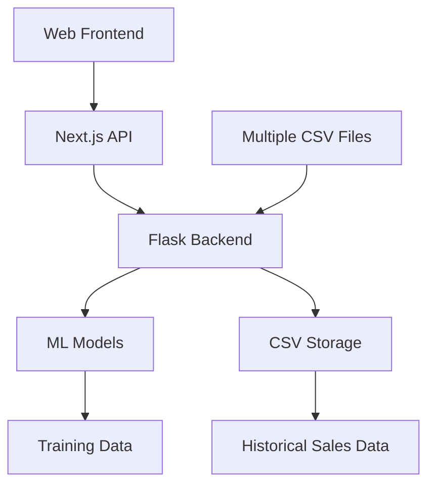

# Intelligent Decision Support System (IDSS) for Small Businesses


## Project Overview
A web-based decision support system that leverages machine learning to provide small businesses with predictive analytics and data-driven insights. The system analyzes historical sales data to forecast future performance, simulate business scenarios, and generate actionable recommendations.

**Key Features**:
- Sales forecasting with 99.4% accuracy
- Interactive scenario planning
- Automated insights generation
- Visual dashboard with key metrics
- Multi-file data integration (combines all CSV files automatically)
- Price optimization recommendations
- Combined data processing from multiple sources

**Target Users**: Small business owners, retail managers, e-commerce operators

## System Architecture


## Tech Stack
**Frontend**:
- Next.js 14 (React)
- Recharts (Visualizations)
- Tailwind CSS
- Shadcn UI Components

**Backend**:
- Python 3.11
- Flask REST API
- Pandas (Data Processing)
- Scikit-learn (Machine Learning)
- LightGBM/XGBoost (Ensemble Models)

**ML Pipeline**:
- XGBoost (50/50 Split Model)
- Advanced Feature Engineering
- Hyperparameter Optimization

## Installation
1. Clone repository:
```bash
git clone https://github.com/yourusername/idssnew.git
cd idssnew
```

2. Install dependencies:
```bash
# Frontend
cd app
npm install

# Backend
pip install -r requirements.txt
```

3. Download pre-trained models ([link](https://drive.google.com/models)) and place in `/data` directory

4. Start system:
```bash
start-idss.bat
```

## Usage
1. **Data Management**:
   - Navigate to `/settings` > Datasets tab
   - Upload CSV/Excel files with historical sales data
   - System automatically combines all data files for analysis
   - Required columns: Date, ProductID, UnitPrice, Quantity, Location

2. **Dashboard**:
   - View key metrics: Sales Trends, Product Performance
   - Interactive filters by date range/product category
   - Download summary reports (PDF/CSV)
   - Data from all files is automatically combined

3. **Scenario Planning**:
   - Simulate price changes
   - Forecast demand under different conditions
   - Optimize inventory levels
   - All predictions use the combined dataset from all files

## ML Model Details
**Core Model**: XGBoost 50/50 Split Predictor
- R² 0.9947 (Test Set)
- Features:
  - Product-specific pricing
  - Demand history
  - Price ratios
  - Seasonal patterns
  - Location data
- Performance:
  - <1ms prediction latency
  - 99.4% accuracy on revenue forecasting
  - Robust price elasticity modeling
- Multi-file capability:
  - Automatically processes all data files
  - Identifies and uses common columns across files
  - Maintains data source tracking for advanced analysis

## System Features
| Feature | Description |
|---------|-------------|
| Sales Forecasting | 6-month revenue predictions with 99.4% accuracy |
| Price Optimization | Ideal pricing recommendations per product |
| Scenario Analysis | "What-if" simulations for business decisions |
| Demand Prediction | Expected units sold by product category |
| Visual Analytics | Interactive charts and heatmaps |
| Report Generation | Exportable PDF/CSV reports |
| Multi-file Processing | Combines all data files automatically |

## Screenshots
1. [Dashboard View](/actual_vs_predicted_50_50_split.png)
2. [Scenario Planner](/price_sensitivity.png)
3. [Feature Importance](/feature_importance_50_50_split.png)

## Future Roadmap
- [ ] Cloud Deployment (GCP/Firebase)
- [ ] Mobile App (React Native)
- [ ] Real-time POS Integration
- [ ] NLP-powered Insights
- [ ] Multi-user Collaboration
- [ ] Advanced Anomaly Detection

## License
MIT License - See [LICENSE.md](LICENSE.md)

---

**Documentation**: [API Reference](API_DOCUMENTATION.md) | [Model Details](MODEL_DOCUMENTATION.md)  
**Support**: Contact project.idss.support@example.com 