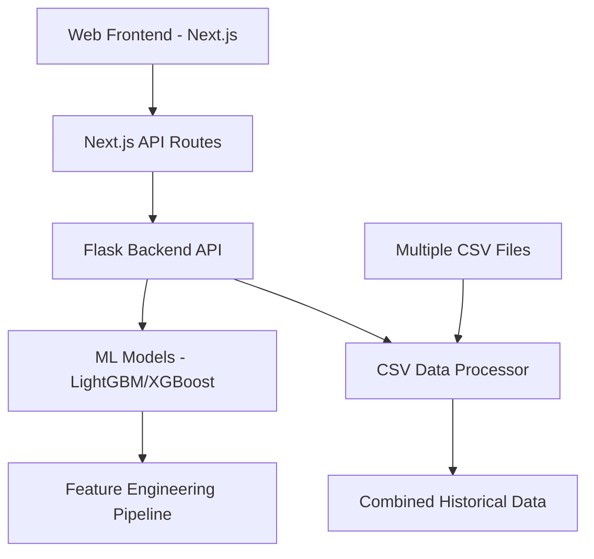
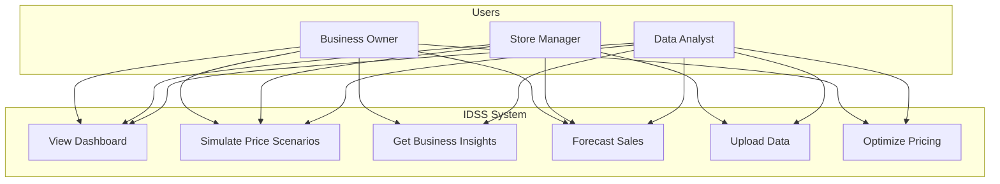
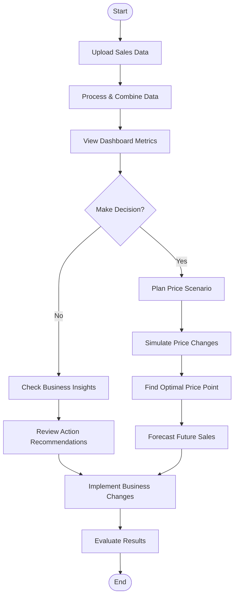
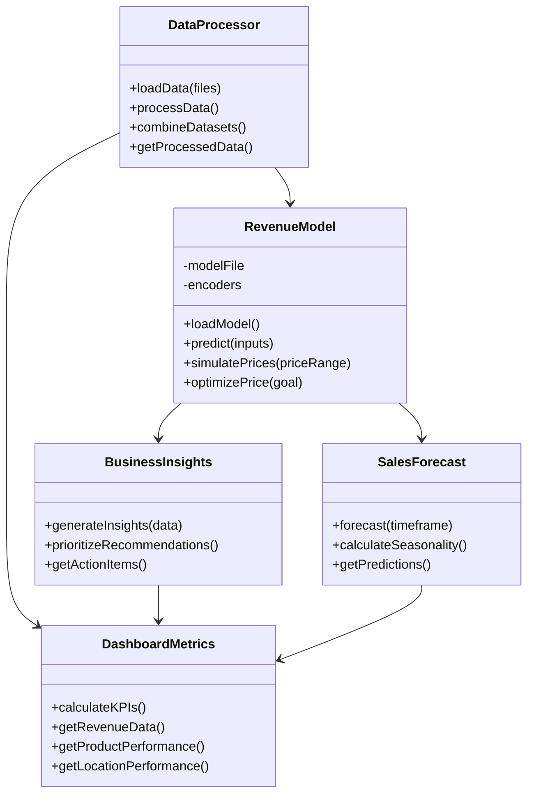
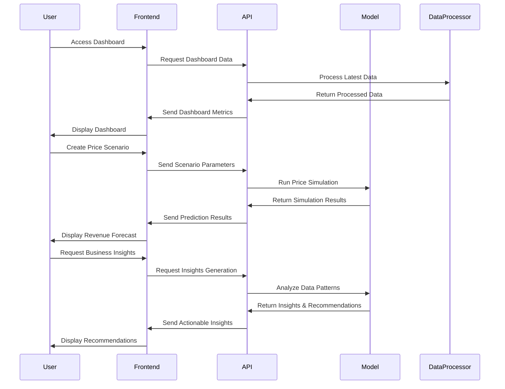

# Intelligent Decision Support System (IDSS) for Small Businesses

## Project Overview
A web-based decision support system that leverages machine learning to provide small businesses with predictive analytics and data-driven insights. The system analyzes historical sales data to forecast future performance, simulate business scenarios, and generate actionable recommendations.

**Key Features**:
- Revenue prediction with 99.47% accuracy (R² = 0.9947)
- Interactive scenario planning with price optimization
- Dynamic business insights with implementation recommendations
- Responsive dashboard with interactive visualizations
- Multi-file data integration with automatic processing
- Price elasticity modeling for revenue optimization
- Seasonal and location-based performance analysis

**Target Users**: Small business owners, retail managers, e-commerce operators

## System Architecture


### Use Case Diagram


### Activity Diagram


### Class Diagram


### Sequence Diagram


## Tech Stack
**Frontend**:
- Next.js 14 (React 18)
- TypeScript
- Recharts for data visualization
- Tailwind CSS with responsive design
- Shadcn UI component library

**Backend**:
- Python 3.11+
- Flask REST API with CORS support
- Pandas for data processing
- Scikit-learn for preprocessing
- LightGBM/XGBoost for ML models

**ML Pipeline**:
- 50/50 Split XGBoost model (R² = 0.9947)
- Advanced feature engineering with price ratios
- Cyclical time encoding for seasonality
- Location-based modeling
- Hyperparameter optimization via RandomizedSearchCV

## Installation
1. Clone repository:
```bash
git clone https://github.com/yourusername/idssnew.git
cd idssnew
```

2. Install dependencies:
```bash
# Frontend
npm install

# Backend
pip install -r requirements.txt
```

3. Download pre-trained models and place in project root directory

4. Start system:
```bash
start-idss.bat
```

## Usage
1. **Data Management**:
   - Upload CSV files with sales data
   - System automatically combines all data files
   - Required columns: Date, ProductID, Location, UnitPrice, UnitCost, Quantity

2. **Dashboard**:
   - Interactive visualizations for revenue trends
   - Product and location performance analysis
   - Filters for date range, product, and location
   - Profit/revenue toggle for deeper analysis

3. **Scenario Planning**:
   - Simulate price changes and their impact on revenue
   - Identify optimal price points for maximum revenue or profit
   - Visualize price sensitivity curves
   - Test seasonal and location-based variations

4. **Business Insights**:
   - Data-driven recommendations with implementation plans
   - Product performance insights with severity ratings
   - Price optimization suggestions
   - Seasonal trend identification

## ML Model Details
**Core Model**: XGBoost 50/50 Split Revenue Predictor
- R² = 0.9947, MAE = 42.69, RMSE = 218.03
- Key Features:
  - Price_vs_Product_Avg (18.21%)
  - Unit Price (9.32%)
  - ProductID_Encoded (9.07%)
  - Price_Seasonal_Deviation (6.57%)
  - Price_Popularity (6.31%)
- Performance:
  - Average prediction time: <0.01s
  - Realistic price elasticity modeling
  - Accurate seasonal pattern recognition

## System Features
| Feature | Description |
|---------|-------------|
| Revenue Prediction | Accurate forecasting with 99.47% accuracy |
| Price Optimization | Optimal pricing recommendations by product |
| Scenario Simulation | Interactive "what-if" analysis for business decisions |
| Responsive Design | Mobile, tablet, and desktop support |
| Dynamic Insights | Data-driven business recommendations |
| Multi-file Processing | Automatic combination of all CSV data files |
| Business Intelligence | Product, location, and seasonal performance analysis |

## Screenshots
1. [Dashboard View](/actual_vs_predicted_50_50_split.png)
2. [Price Sensitivity](/price_sensitivity.png)
3. [Feature Importance](/feature_importance_50_50_split.png)

## Future Roadmap
- [ ] Cloud Deployment (AWS/Azure/GCP)
- [ ] Advanced Anomaly Detection
- [ ] Inventory Optimization
- [ ] Customer Segmentation Analysis
- [ ] AI-powered Strategy Recommendations
- [ ] Real-time Data Integration

## License
MIT License - See [LICENSE.md](LICENSE.md)

---

**Documentation**: [API Reference](API_DOCUMENTATION.md) | [Model Documentation](MODEL_DOCUMENTATION.md) | [Insights Documentation](MODEL_DOCUMENTATION_INSIGHTS.md)  
**Support**: Contact support@idss-system.com 