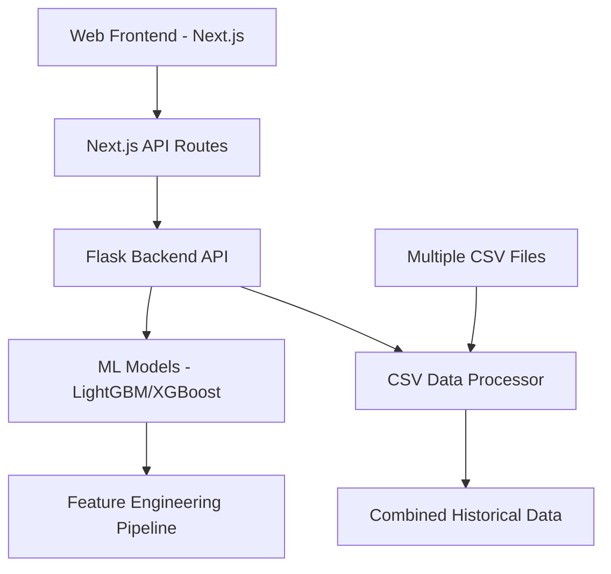
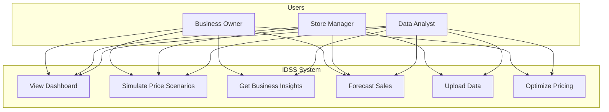
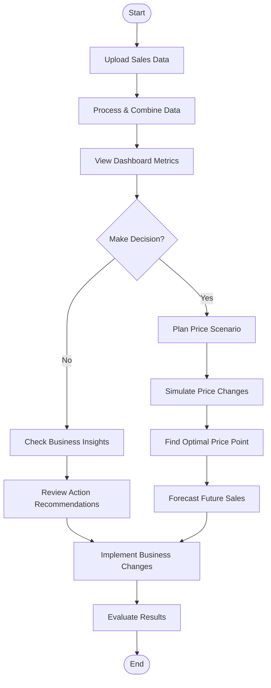
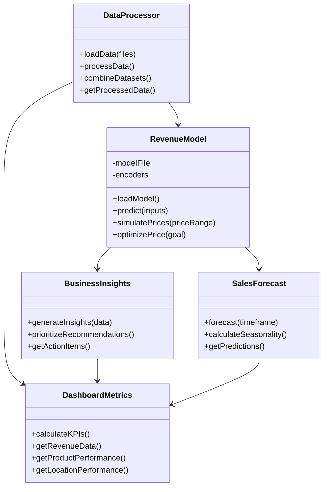
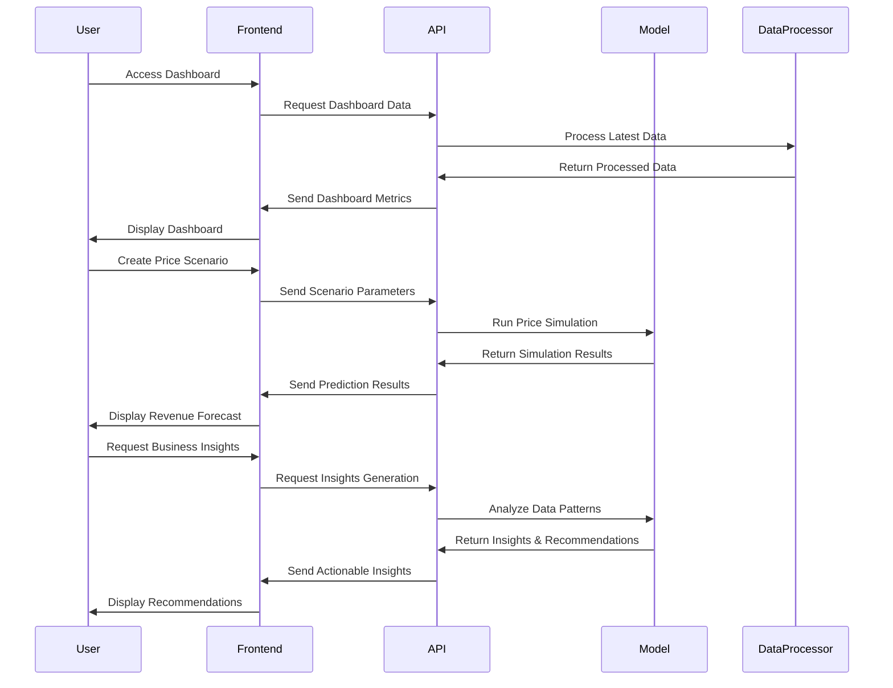

## System Architecture

```mermaid
graph TD
    A[Web Frontend - Next.js] --> B[Next.js API Routes]
    B --> C[Flask Backend API]
    C --> D[ML Models - LightGBM/XGBoost]
    D --> E[Feature Engineering Pipeline]
    C --> F[CSV Data Processor]
    F --> G[Combined Historical Data]
    H[Multiple CSV Files] --> F
```

### Use Case Diagram

```mermaid
graph TD
    subgraph "IDSS System"
        UC1[View Dashboard]
        UC2[Simulate Price Scenarios]
        UC3[Get Business Insights]
        UC4[Forecast Sales]
        UC5[Upload Data]
        UC6[Optimize Pricing]
    end
    
    subgraph "Users"
        BOwner[Business Owner]
        Manager[Store Manager]
        Analyst[Data Analyst]
    end
    
    BOwner --> UC1
    BOwner --> UC2
    BOwner --> UC3
    BOwner --> UC4
    BOwner --> UC6
    
    Manager --> UC1
    Manager --> UC2
    Manager --> UC4
    Manager --> UC5
    
    Analyst --> UC1
    Analyst --> UC2
    Analyst --> UC3
    Analyst --> UC4
    Analyst --> UC5
    Analyst --> UC6
```

### Activity Diagram

```mermaid
graph TD
    Start([Start]) --> UploadData[Upload Sales Data]
    UploadData --> ProcessData[Process & Combine Data]
    ProcessData --> ViewDashboard[View Dashboard Metrics]
    
    ViewDashboard --> Decision{Make Decision?}
    Decision -->|Yes| PlanScenario[Plan Price Scenario]
    Decision -->|No| CheckInsights[Check Business Insights]
    
    PlanScenario --> SimulatePrice[Simulate Price Changes]
    SimulatePrice --> OptimizePrice[Find Optimal Price Point]
    OptimizePrice --> ForecastSales[Forecast Future Sales]
    
    CheckInsights --> ReviewRecommendations[Review Action Recommendations]
    ReviewRecommendations --> ImplementChanges[Implement Business Changes]
    
    ForecastSales --> ImplementChanges
    ImplementChanges --> Evaluate[Evaluate Results]
    Evaluate --> End([End])
```

### Class Diagram

```mermaid
classDiagram
    class DataProcessor {
        +loadData(files)
        +processData()
        +combineDatasets()
        +getProcessedData()
    }
    
    class RevenueModel {
        -modelFile
        -encoders
        +loadModel()
        +predict(inputs)
        +simulatePrices(priceRange)
        +optimizePrice(goal)
    }
    
    class BusinessInsights {
        +generateInsights(data)
        +prioritizeRecommendations()
        +getActionItems()
    }
    
    class SalesForecast {
        +forecast(timeframe)
        +calculateSeasonality()
        +getPredictions()
    }
    
    class DashboardMetrics {
        +calculateKPIs()
        +getRevenueData()
        +getProductPerformance()
        +getLocationPerformance()
    }
    
    DataProcessor --> RevenueModel
    DataProcessor --> DashboardMetrics
    RevenueModel --> BusinessInsights
    RevenueModel --> SalesForecast
    BusinessInsights --> DashboardMetrics
    SalesForecast --> DashboardMetrics
```

### Sequence Diagram

```mermaid
sequenceDiagram
    participant User
    participant Frontend
    participant API
    participant Model
    participant DataProcessor
    
    User->>Frontend: Access Dashboard
    Frontend->>API: Request Dashboard Data
    API->>DataProcessor: Process Latest Data
    DataProcessor->>API: Return Processed Data
    API->>Frontend: Send Dashboard Metrics
    Frontend->>User: Display Dashboard
    
    User->>Frontend: Create Price Scenario
    Frontend->>API: Send Scenario Parameters
    API->>Model: Run Price Simulation
    Model->>API: Return Simulation Results
    API->>Frontend: Send Prediction Results
    Frontend->>User: Display Revenue Forecast
    
    User->>Frontend: Request Business Insights
    Frontend->>API: Request Insights Generation
    API->>Model: Analyze Data Patterns
    Model->>API: Return Insights & Recommendations
    API->>Frontend: Send Actionable Insights
    Frontend->>User: Display Recommendations
```