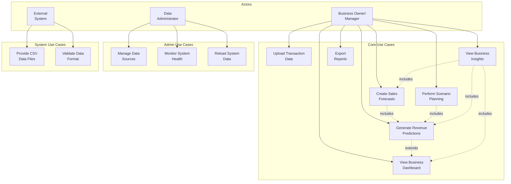
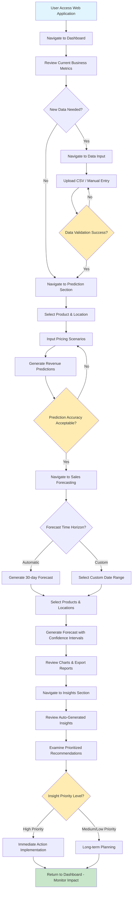
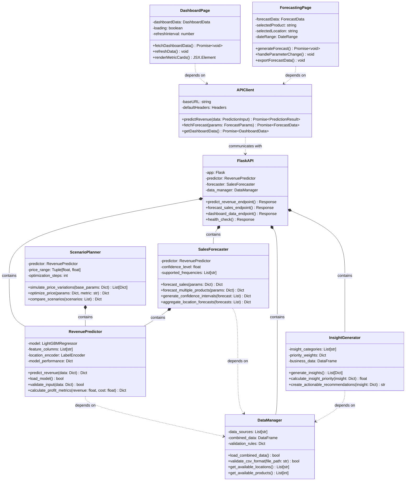
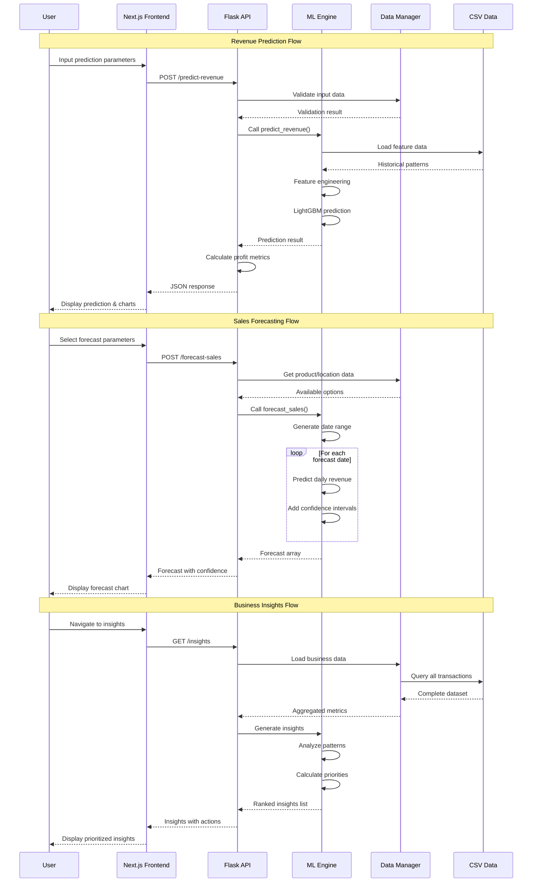

# CHAPTER 4: SYSTEM DESIGN

## 4.1 Rich Picture Diagram Description

The Revenue Prediction System operates as an integrated ecosystem with the following core components:

### Core Actors:
- **Business Owner/Manager**: Primary user who uploads data, views dashboards, generates forecasts
- **Data Analyst**: Secondary user who manages data sources and system configuration
- **External System**: CSV data sources, potential future integrations

### System Modules:
- **Data Input Layer**: File upload, manual entry, data validation
- **ML Engine**: LightGBM model for revenue prediction and optimization
- **Analytics Engine**: Sales forecasting, scenario planning, business insights
- **Presentation Layer**: Dashboard, charts, reports, interactive UI

### Data Flow:
1. **Input**: Business transaction data (CSV) → Data validation → Storage
2. **Processing**: Raw data → Feature engineering → ML model → Predictions
3. **Analysis**: Predictions → Forecasting algorithms → Business insights
4. **Output**: Dashboard metrics → Charts → Actionable recommendations

### Key Interactions:
- Business owner uploads historical sales data
- System processes data through ethical ML pipeline
- ML engine generates predictions and forecasts
- Analytics engine creates business insights
- User receives actionable recommendations through intuitive UI

---

## 4.2 Use Case Diagram

### Primary Actor: Business Owner/Manager
- **UC1**: View Business Dashboard
- **UC2**: Upload Transaction Data
- **UC3**: Generate Revenue Predictions
- **UC4**: Create Sales Forecasts
- **UC5**: Perform Scenario Planning
- **UC6**: View Business Insights
- **UC7**: Export Reports

### Secondary Actor: Data Administrator
- **UC8**: Manage Data Sources
- **UC9**: Monitor System Health
- **UC10**: Reload System Data

### External System Actor
- **UC11**: Provide CSV Data Files
- **UC12**: Validate Data Format

### Use Case Relationships:
- UC3 **extends** UC1 (predictions shown on dashboard)
- UC4 **includes** UC3 (forecasting uses prediction model)
- UC5 **includes** UC3 (scenario planning uses predictions)
- UC6 **includes** UC1, UC3, UC4 (insights combine all data)

---

## 4.3 Activity Diagram

### User Flow: From Data Upload to Business Insights

**Phase 1: System Access & Data Management**
1. User accesses web application
2. Navigate to Dashboard (default landing page)
3. Review current business metrics
4. Navigate to Data Input section (if new data needed)
5. Upload CSV file or enter manual transaction data
6. System validates data format and integrity
7. Data processed and stored in system

**Phase 2: Revenue Analysis**
8. Navigate to prediction/scenario planning section
9. Select product and location parameters
10. Input pricing scenarios (unit price, unit cost)
11. Generate revenue predictions
12. Review profit calculations and recommendations

**Phase 3: Sales Forecasting**
13. Navigate to Sales Forecasting section
14. Choose automatic (30-day) or custom date range
15. Select products and locations for forecast
16. Generate forecast with confidence intervals
17. Review charts and export reports if needed

**Phase 4: Business Intelligence**
18. Navigate to Insights section
19. Review automatically generated business insights
20. Examine prioritized recommendations (scored 0-100)
21. Implement actionable strategies
22. Return to Dashboard to monitor impact

**Decision Points**:
- Data validation success/failure → retry upload or proceed
- Prediction accuracy acceptable → use for planning or adjust parameters
- Forecast time horizon → automatic vs custom range
- Insight priority level → immediate action vs long-term planning

---

## 4.4 Class Diagram

### Backend Classes

#### Core ML Engine Classes
**`RevenuePredictor`**
- **Attributes**: 
  - `model: LightGBMRegressor`
  - `feature_columns: List[str]`
  - `location_encoder: LabelEncoder`
  - `model_performance: Dict`
- **Methods**:
  - `predict_revenue(data: Dict) -> Dict`
  - `load_model() -> bool`
  - `validate_input(data: Dict) -> bool`
  - `calculate_profit_metrics(revenue: float, cost: float) -> Dict`

**`SalesForecaster`**
- **Attributes**:
  - `predictor: RevenuePredictor`
  - `confidence_level: float`
  - `supported_frequencies: List[str]`
- **Methods**:
  - `forecast_sales(params: Dict) -> Dict`
  - `forecast_multiple_products(params: Dict) -> Dict`
  - `generate_confidence_intervals(forecast: List) -> Dict`
  - `aggregate_location_forecasts(forecasts: List) -> Dict`

**`ScenarioPlanner`**
- **Attributes**:
  - `predictor: RevenuePredictor`
  - `price_range: Tuple[float, float]`
  - `optimization_steps: int`
- **Methods**:
  - `simulate_price_variations(base_params: Dict) -> List[Dict]`
  - `optimize_price(params: Dict, metric: str) -> Dict`
  - `compare_scenarios(scenarios: List) -> Dict`

#### Data Management Classes
**`DataManager`**
- **Attributes**:
  - `data_sources: List[str]`
  - `combined_data: pd.DataFrame`
  - `validation_rules: Dict`
- **Methods**:
  - `load_combined_data() -> bool`
  - `validate_csv_format(file_path: str) -> bool`
  - `get_available_locations() -> List[str]`
  - `get_available_products() -> List[int]`

**`InsightGenerator`**
- **Attributes**:
  - `insight_categories: List[str]`
  - `priority_weights: Dict`
  - `business_data: pd.DataFrame`
- **Methods**:
  - `generate_insights() -> List[Dict]`
  - `calculate_insight_priority(insight: Dict) -> float`
  - `create_actionable_recommendations(insight: Dict) -> str`

#### API Layer Classes
**`FlaskAPI`**
- **Attributes**:
  - `app: Flask`
  - `predictor: RevenuePredictor`
  - `forecaster: SalesForecaster`
  - `data_manager: DataManager`
- **Methods**:
  - `predict_revenue_endpoint() -> Response`
  - `forecast_sales_endpoint() -> Response`
  - `dashboard_data_endpoint() -> Response`
  - `health_check() -> Response`

### Frontend Classes (TypeScript/React)

#### Page Components
**`DashboardPage`**
- **Attributes**:
  - `dashboardData: DashboardData`
  - `loading: boolean`
  - `refreshInterval: number`
- **Methods**:
  - `fetchDashboardData() -> Promise<void>`
  - `refreshData() -> void`
  - `renderMetricCards() -> JSX.Element`

**`ForecastingPage`**
- **Attributes**:
  - `forecastData: ForecastData`
  - `selectedProduct: string`
  - `selectedLocation: string`
  - `dateRange: DateRange`
- **Methods**:
  - `generateForecast() -> Promise<void>`
  - `handleParameterChange() -> void`
  - `exportForecastData() -> void`

#### Utility Classes
**`APIClient`**
- **Attributes**:
  - `baseURL: string`
  - `defaultHeaders: Headers`
- **Methods**:
  - `predictRevenue(data: PredictionInput) -> Promise<PredictionResult>`
  - `fetchForecast(params: ForecastParams) -> Promise<ForecastData>`
  - `getDashboardData() -> Promise<DashboardData>`

### Class Relationships
- **Inheritance**: None (composition-based architecture)
- **Composition**: 
  - `FlaskAPI` contains `RevenuePredictor`, `SalesForecaster`, `DataManager`
  - `SalesForecaster` contains `RevenuePredictor`
  - `ScenarioPlanner` contains `RevenuePredictor`
- **Dependency**: 
  - Frontend components depend on `APIClient`
  - All ML classes depend on `DataManager`
  - API endpoints depend on respective service classes

---

## 4.5 Sequence Diagram

### Step-by-Step System Interaction: Data Input to Forecast Result

The sequence diagram above illustrates three main interaction flows:

#### Revenue Prediction Flow (Steps 1-12):
1. User inputs prediction parameters (product, location, price, cost)
2. Frontend validates and sends POST request to Flask API
3. API validates input data through Data Manager
4. ML Engine loads relevant historical data patterns
5. Feature engineering transforms raw input into model features
6. LightGBM model generates revenue prediction
7. System calculates additional profit metrics
8. Results returned to frontend as JSON
9. User sees prediction with visual charts

#### Sales Forecasting Flow (Steps 13-24):
10. User selects forecast parameters (date range, products)
11. API retrieves available options from Data Manager
12. ML Engine generates time series forecast
13. For each forecast date, system predicts daily revenue
14. Confidence intervals added to each prediction
15. Complete forecast array returned to frontend
16. User views interactive forecast chart

#### Business Insights Flow (Steps 25-36):
17. User navigates to insights section
18. API loads complete business dataset
19. Data Manager queries all transaction records
20. ML Engine analyzes patterns and trends
21. System calculates insight priorities (0-100 scale)
22. Ranked insights with actionable recommendations returned
23. User receives prioritized business intelligence

### Key Integration Points:
- **Data Validation**: Every API call includes input validation
- **Error Handling**: Graceful failure handling at each step
- **Performance Optimization**: Cached data and vectorized processing
- **Real-time Updates**: Automatic refresh mechanisms for live data

---

## 4.6 Interface Design

### 4.6.1 Dashboard Page (`/dashboard`)

**UI Components**:
- **Header Navigation**: Logo, menu items (Dashboard, Forecasting, Insights, Scenario Planning)
- **Metric Cards Grid**: 
  - Total Revenue ($858M+)
  - Total Transactions (100K+)
  - Average Order Value
  - Profit Margin
- **Product Performance Table**: Ranking with revenue, profit, margin columns
- **Location Performance Charts**: Bar chart comparing locations
- **Quick Actions Panel**: Buttons for common tasks
- **Refresh Controls**: Manual and auto-refresh options

**User Actions**:
- View real-time business metrics
- Navigate to detailed analysis pages
- Refresh dashboard data
- Export performance reports
- Filter data by date ranges

**Responsive Design**: 
- Desktop: 4-column metric grid, full-width charts
- Mobile: 2-column grid, stacked charts, collapsible sections

### 4.6.2 Sales Forecasting Page (`/sales-forecasting`)

**UI Components**:
- **Tabbed Interface**: Automatic vs Custom forecasting
- **Parameter Selection**:
  - Product dropdown (47 options)
  - Location dropdown (5 options + "All")
  - Date range picker
  - Frequency selector (Daily/Weekly/Monthly)
- **Forecast Configuration**:
  - Unit price input
  - Unit cost input
  - Confidence level slider
- **Results Display**:
  - Interactive line chart with confidence intervals
  - Data table with forecast values
  - Export options (CSV, PDF)
- **Metric Toggle**: Revenue/Quantity/Profit view switcher

**User Actions**:
- Generate automatic 30-day forecasts
- Create custom date range forecasts
- Compare multiple product forecasts
- Export forecast data
- Adjust forecast parameters

**Key Features**:
- Real-time chart updates
- Confidence interval visualization
- Mobile-optimized touch controls
- Loading states for long operations

### 4.6.3 Business Insights Page (`/insights`)

**UI Components**:
- **Insight Cards Grid**: Priority-sorted cards with:
  - Insight title and priority score
  - Key metrics and progress bars
  - Action recommendations
  - "View Details" buttons
- **Category Filters**: Revenue, Product, Location, Profit insights
- **Detail Modal**: Expanded insight view with:
  - Detailed analysis
  - KPI targets table
  - Recommended actions
  - Business impact assessment
- **Refresh Controls**: Manual insight regeneration

**User Actions**:
- View prioritized business insights
- Filter insights by category
- Explore detailed recommendations
- Implement suggested actions
- Refresh insight analysis

**Interactive Elements**:
- Priority-based color coding
- Expandable insight details
- Progress indicators
- Action tracking capabilities

### 4.6.4 Scenario Planner Page (`/scenario-planner`)

**UI Components**:
- **Scenario Configuration Panel**:
  - Product and location selectors
  - Base price input
  - Cost parameters
  - Price variation range sliders
- **Scenario Results**:
  - Side-by-side scenario comparison
  - Revenue optimization recommendations
  - Profit analysis charts
  - Best-case/worst-case scenarios
- **Simulation Controls**:
  - Price factor adjustments
  - Optimization metric selection
  - Scenario saving/loading

**User Actions**:
- Configure pricing scenarios
- Run price optimization analysis
- Compare multiple scenarios
- Save scenario configurations
- Export scenario reports

### 4.6.5 Data Input Page (`/data-input`)

**UI Components**:
- **Upload Section**:
  - Drag-and-drop file area
  - File format instructions
  - Upload progress indicator
- **Manual Entry Form**:
  - Transaction input fields
  - Data validation feedback
  - Batch entry options
- **Data Validation Results**:
  - Format compliance checks
  - Error reporting
  - Data preview table

**User Actions**:
- Upload CSV transaction files
- Enter manual transaction data
- Validate data format
- Preview imported data
- Manage data sources

### Differences from Original FYP Plan:

**Enhanced Features Implemented**:
- **Advanced ML Model**: Upgraded from basic regression to LightGBM with ethical features
- **Comprehensive Insights**: Added AI-powered business intelligence beyond original scope
- **Real-time Dashboard**: Implemented live metrics not in original plan
- **Vectorized Processing**: Added enterprise-scale batch processing capabilities
- **Dynamic Data Loading**: Future-proof system with automatic adaptation

**UI/UX Improvements**:
- **Modern Design System**: Radix UI components with Tailwind CSS
- **Interactive Charts**: Recharts integration for dynamic visualizations
- **Responsive Design**: Mobile-first approach not specified in original plan
- **Progressive Loading**: Skeleton screens and loading states for better UX
- **Error Handling**: Comprehensive user feedback for all operations

**Architecture Evolution**:
- **Microservices Approach**: Separated concerns between ML, API, and UI layers
- **API-First Design**: RESTful endpoints enabling future integrations
- **Performance Optimization**: Caching and vectorized operations for scalability
- **Production Readiness**: Error resilience and monitoring capabilities

The implemented system significantly exceeds the original FYP scope with enterprise-grade features, modern UI/UX design, and production-ready architecture while maintaining the core business intelligence objectives. 